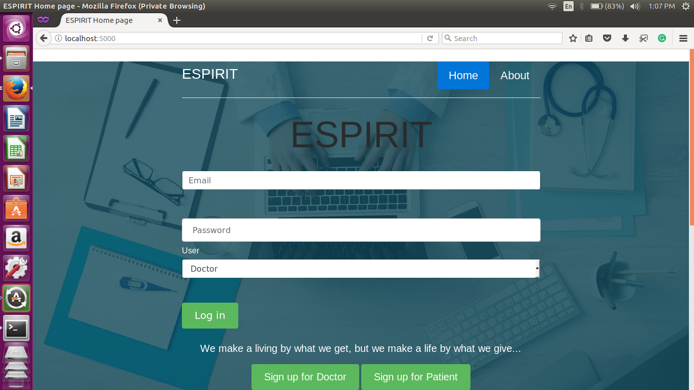
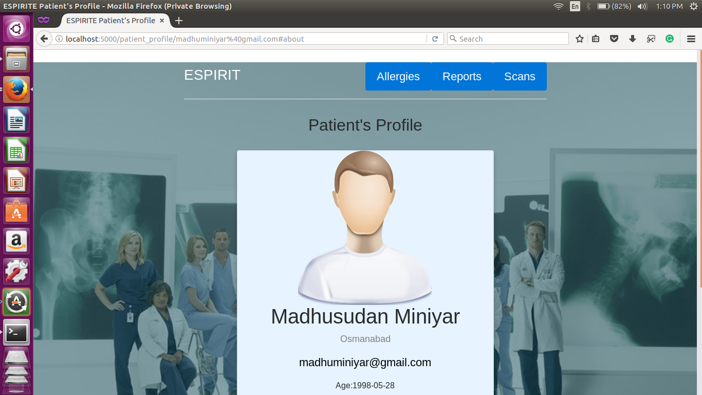
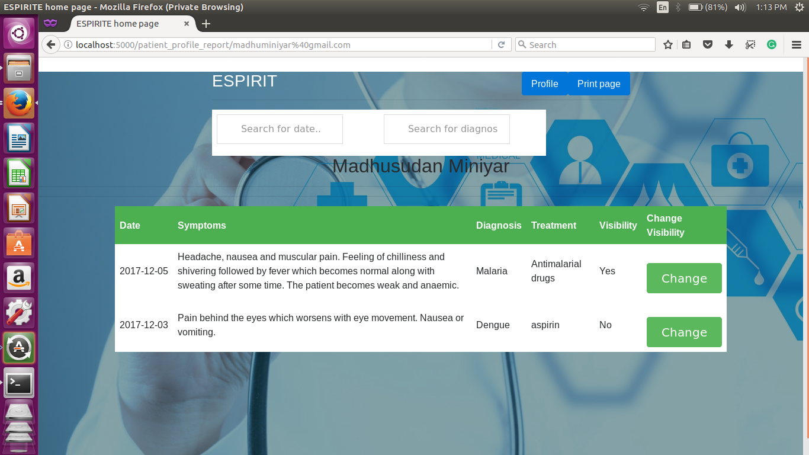
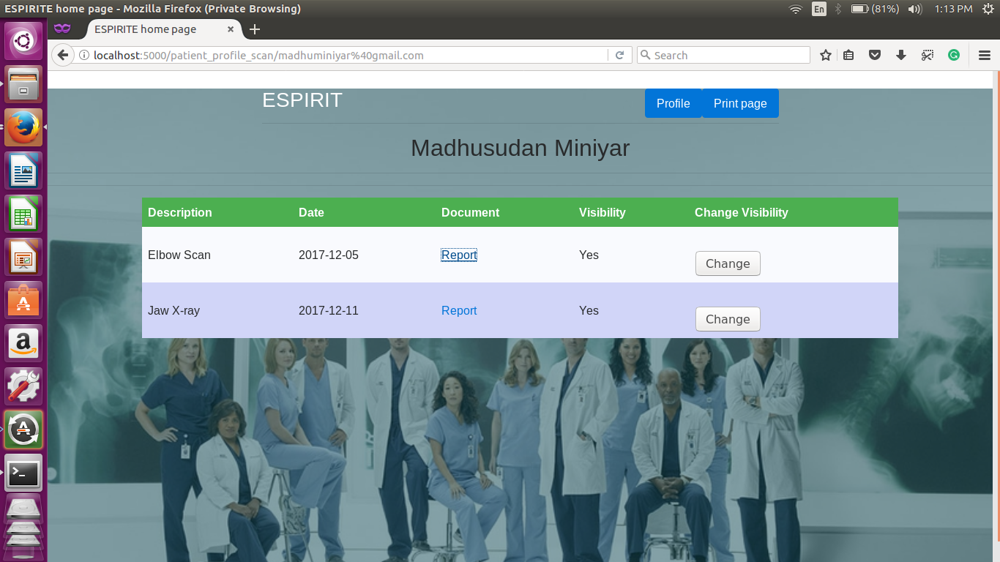
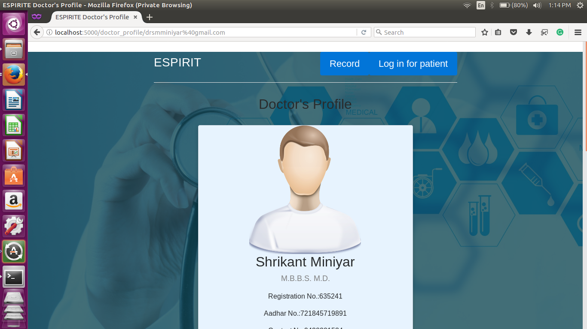
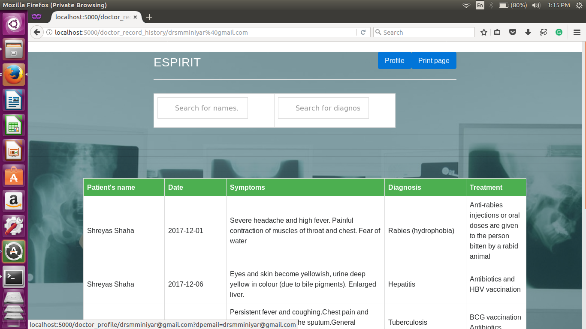
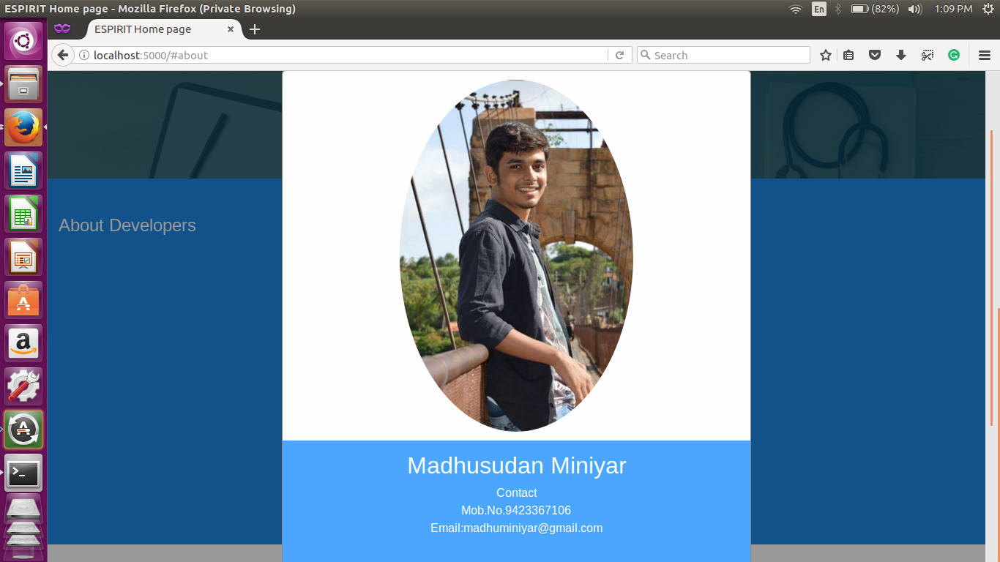
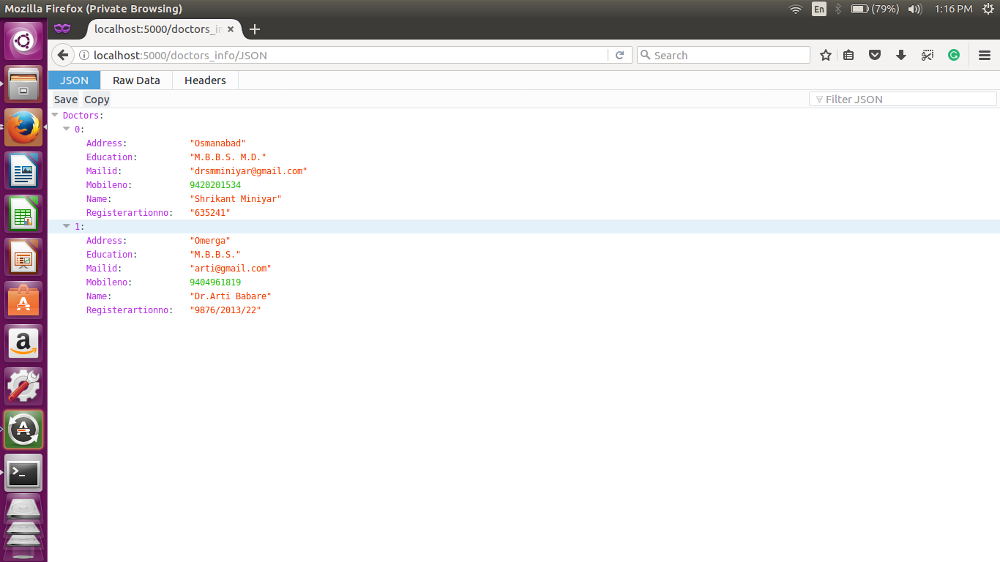

# E-Spirit
It is the Web portal will provide interface, in which doctor can enter patients’ diagnosis which will include the prescriptions, medical test reports including images (e.g.X -ray, Sonography Reports, Blood Reports).
## **Home Page**

  
  
## **Patient Profile**

  
  
 ## **Patient Report**
 

  
  
## **Patient Scan**

  
  
## **Doctor Profile**

  
  
## **Doctor Record**

  
  
## **About us**

  
  
## **API**

  

